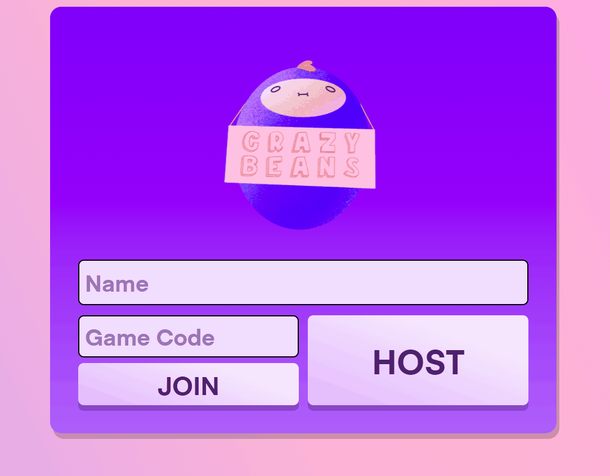
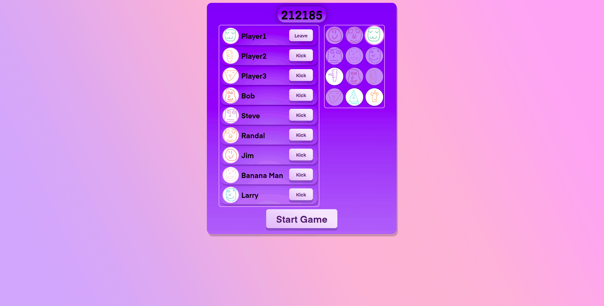
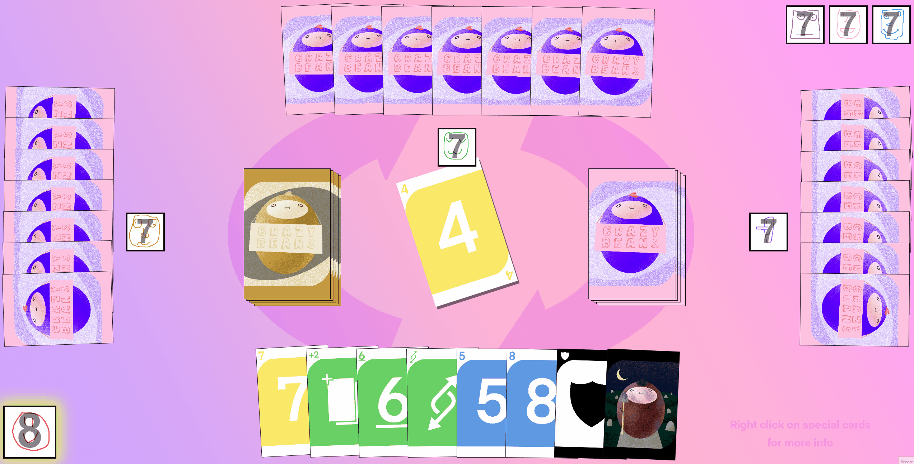
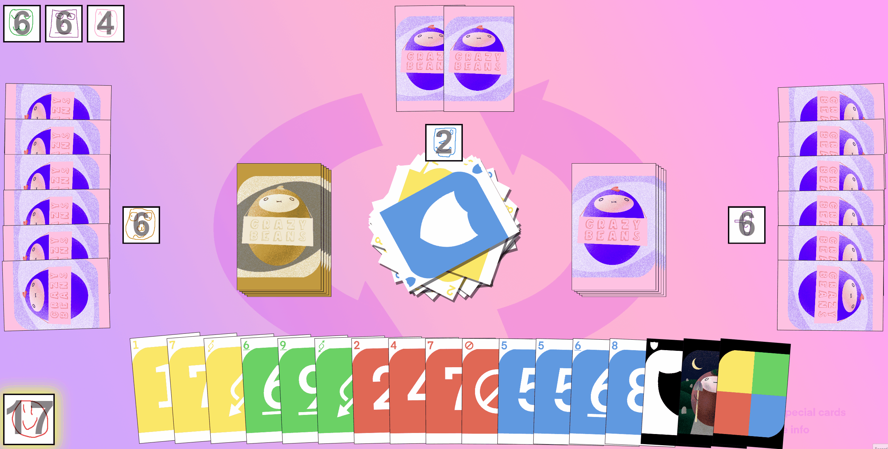
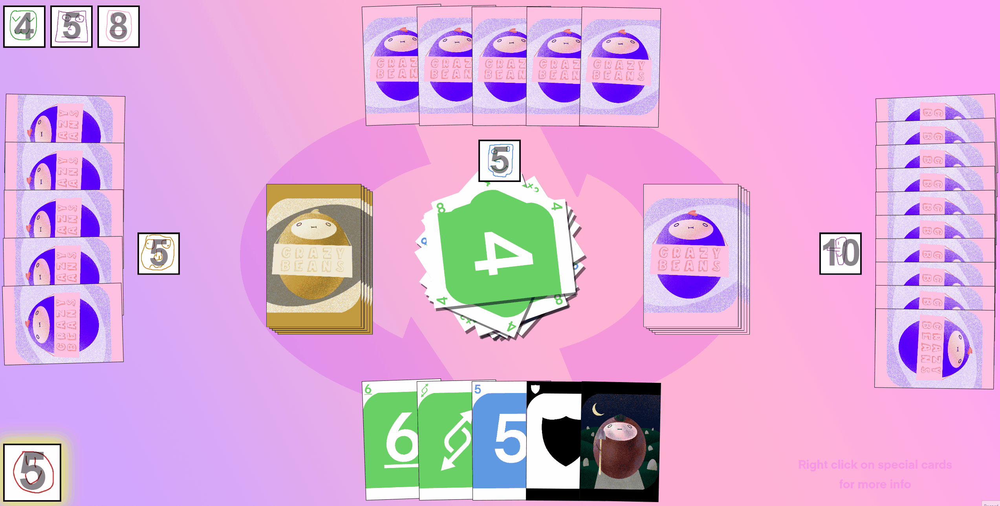

# Crazy Beans
# Table of Contents
[TRY IT OUT!](https://alex-hyde.github.io/crazy-beans/)

- [Introduction](#introduction)
- [Menu](#menu)
  * [Host Game](#host-game)
  * [Join Game](#join-game)
  * [Start Game](#start-game)
- [Gameplay](#gameplay)
  * [Special Cards](#special-cards)

# Introduction
Crazy Beans is a chaotic multiplayer card game developed by

[Alex Hyde](https://github.com/Alex-Hyde) 
[Sebastian Villate](https://github.com/Sebvillate) 
[Kevin Li](https://github.com/li-kevin-987) 

This game was developed utilizing a ReactJS front end, paired with a Firebase backend to power online multiplayer functionality.

# Menu

## Host Game

## Join Game

## Start Game

# Gameplay

## Special Cards

